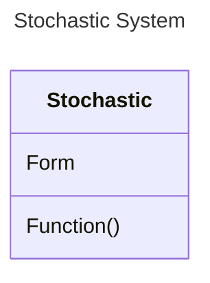
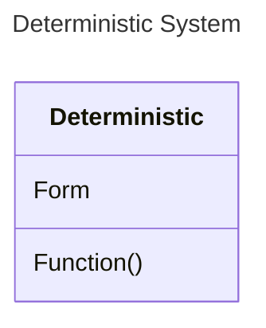

https://www.gov.uk/government/news/emerging-disruptive-technologies-nato-competition?utm_medium=email&utm_campaign=govuk-notifications-topic&utm_source=01b512aa-21fe-4b79-8dee-185e9b90f6a0&utm_content=weekly

# What do you think are the opportunities and risks of emerging and disruptive technologies?

## The Techonolgies
There is a lot of hype around Artificial Intelligence, the term itself is vague since it encompasses many subdomains. Autopilot systems in aircraft have existed for many years, yet many don't consider autopilots as AI. And yet, many wouldn't feel safe flying if ChatGPT was known to be controlling the aircraft. Modern LLMs can be thought of as extremely high-reliability stochastic processes; when you input the same question twice, you get two convincing, but different answers. Aircraft autopilot systems are the deterministic equivalent; for two of the same set of input signals, the autopilot will give the same outputs for both. Autopilots are virtual pilots that have undergone strict tests to ensure robustness under critical conditions, such that the passengers and crew will land safely.

An LLM's strength is in interpreting written language and predicting what word should come next in a stream of text. An autopilot's strength is ensuring that an aircraft remains stable in the face of turbulence. This essay forecasts a world in which these two types of systems (stochastic and deterministic) combine at scale. I examine what happens as a result of those combinations as singular entities, and forecast emergent behaviours of combinations of these stochastic-deterministic entities. 

### The Combination of a Stochastic and a Deterministic System

#### Stochastic Systems

Stochastic systems are those in which for any two of the same inputs, you get two different outputs. They exist in the world of probability and statistics. They excel at handling uncertainty through prediction. A probabilistic outcome is like an educated guess - better statistical models will be correct most of the time, but it is rare that they are correct 100% of the time. This is what makes them great at managing uncertainty. 

When YouTube recommends you a video, it is doing so with a certain probability that you will watch it. 

#### Deterministic Systems 

Deterministic Systems are those in which for any two of the same inputs, you get the same output. They exist in the world of pure mathematics and system dynamics. They excel at delivering robust and reliable results. 

Deterministic systems are like machines - you pull a lever 10 degrees, and the cog turns 90 degrees, and it does this 100% of the time (unless it breaks). 

Deterministic systems include things like cars, robots, planes - most machines in physical reality can be considered deterministic. Other examples include buildings etc. 

#### Combining the Two

Often times, when considering a technology to make predictions, or model a system or process, engineers must choose an approach that leverages one or the other technique. When there is lots of data available, a stochastic approach makes more sense because the system can be trained to make better predictions. When there is less data available, a simplified deterministic approach is often used, capturing enough dynamics to ensure the 

Although philosophers may argue on the topic, reality is deterministic. The uncertainty comes from non-linearities, chaos and network effects that require too much processing to effectively compute an outcome in a shorter time than it takes for the dynamics of a system to occur. Hence, much effort is expended in creating stochastic models of a deterministic reality. 

Similarly, stochastic methods are used to generate deterministic models. These models capture data, and using optimisation techniques are able to fit the data to groups of mathematical functions that describe the system accurately enough for the use case. 

However, in both of these cases, stochastic and deterministic processes are used to translate between the two paradigms. 

Both paradigms have their own strengths. Stochastic systems are great for simplifying complex dynamics and generating high quality 'educated guesses', but they always retain the liability of being wrong that 0.0000001% of the time. Deterministic systems are extremely useful to accurately describe and understand interactions and behaviours of complex systems. Deterministic systems are mathematical machines that are based on first principles, but are liable to becoming computationally intensive. 

Both of these paradigms have their own strengths and weaknesses, and much effort has been placed on translating between the two. 

---

The MCP Protocol defined a way for these two paradigms to 'talk' for the first time.

The two landmark moments in technology in the 2010s were the advent of AI in AlphaGo and the development of robotic systems seen from Boston dynamics. Boston dynamics in the early 2010s demonstrated to the world what can happen when you combine deterministic and stochastic systems well, combining vision-based reinforcement learning with advanced control algorithms. These events demonstrate what can occur when leveraging each system type to its unique advantage - stochastic vision models to interpret the world, and deterministic control algorithms to do something with that information. 

These technologies have since become much more accessible. In the first half of this decade we have seen the start of what can happen when these technologies are pushed and combined. Humanoid robotics are a representation of what can happen when you combine language models with hardware. This industry currently promises a generalist robot assistant much in the same way that LLMs promise a virtual assistant. Much of the current innovation landscape lies in the intersection of the two - stochastic and deterministic systems. Anthropic's Model Context Protocol (MCP) defines a communications protocol for language models (Stochastic) to interact with existing software (much of which is deterministic). Currently, major players are still understanding the benefits and limitations of such technologies - including security ramifications of exposing software using MCP. This technology is still in its early maturation phase. 

## Concerning Humans
Human beings can be thought of as systems that resolve uncertainty in order to form goals. For example, you might drive more cautiously in a dark road at night. The resolving uncertainty aspect is an example of stochastic reasoning, you are making judgements based on incomplete information. The goal is to drive safely. Hence, you adjust your movements (deterministic) in order to drive more safely. 

Human beings evolved to work in groups to handle increasingly abstract and complex problems effectively, including inter-species cooperation. Consider a sheep herder - as a whole system there are three species involved - sheep, humans, and dogs. Each of these species has their own individual goals. The sheep want to eat grass, the dog wants to respect the owner, and the owner wants to maximise the value of the sheep. The owner then orchestrates the interactions between the dogs and the sheep, factoring in things such as weather, time of year, soil health, the sheep's health, and the dog's health - these are long-term dynamics that the owner learns through experience. They make decisions based on incomplete information, and then act on those decisions.

The sheep herding system is an example of a system of systems (SoS) that can be considered an organisation. It is a self organising that achieves a goal. It blends organisms that take long-term decisions and create short-term goals. 

In a society, there are many such interacting organisations. The sheep herding organisation produces meat and wool for other butchers and tailors, both of which consist of groups of humans who have learned to work together to achieve a goal.

So if we consider a society to be a collection of organisations, each interacting with one another, and for each organisation to consist of a collection of systems that use stochastic reasoning and deterministic actions to achieve a goal, we have set a mental framework for what a society is. Organisations have unique structures and goals, and interact with other organisations in a unique way in order to realise their goals. The collective structures and goals of organisations form a society. 

We now have a framework for thinking about individuals, organisations and societies, viewing them through the lens of stochastic & deterministic systems. 

What modern technologies such as language models, robotics, machine vision and the like present are the individual components that can replace a human being at doing a job. Taking the sheep herding example - imagine we were to replace that organisation in a way that replaces the human being and the dog. 

The human being's stochastic reasoning (making judgements with uncertainty) can be replaced by large datasets of geospatial data, real-time telemetry from sensors on the field, drone survaillence, as well as embedded human knowledge/intuition. Combining such technologies will lead to the stochastic element of the sheep herder to make better, more scientific & efficient judgements on which field the sheep should be placed, when, and for how long. 

The deterministic aspect of the sheep herding system is then replaced in two ways. There is no individual 'sheep herder' on the field to manage the sheep dogs. This can all be done remotely through telemetry, and the sheep dogs can be replaced by robot dogs. Robot dogs communicate with one another through more telemetry, and they too make judgements in uncertainty through machine vision and neural network algorithms. 

So we've now replaced the sheep herding organisation with a fully automated replica. It is more efficient, can function 24/7, and stores all known science about sheep herding in its knowledge base. 

Now consider that this sheep herding organisation also has to interact with wider society. It generates and uses resources - it generating wool and using sheep feed. The textile workshop is also fully automated, again in its own unique way - an automated overseeing intelligent system and multiple warehouse robots and automated processes. The sheep herding organisation and the textile workshop interact completely autonomously, trading goods via a fully automated logistics system, again with its own stochastic and deterministic components. 

What such a scenario leads to is a fully automated society of its own, operating in the digital world independent of any human involvement other than those who built and maintain that society. 

When this scenario is brought to its full extent, with parallel digital societies existing alongside human societies, an entire new paradigm comes. 

## Societies of Societies

Given that human beings will need to create these societies, there are a number of ramifications. Until now, and given that we exist in societies of our own, we understand the social norms and interpersonal dynamics that occur with groups of human beings, and in some cases human beings with animals. 

We will inadvertently create societies that represent these types of interactions, at least on some level. A digital society created by Americans will interact differently to a society created by the Vietnamese, even if it's only due to what the system should prioritise. Should it prioritise making money, resource efficiency, or its interactions with human beings?

The parallel digital societies we will create will show us reflections of our own values, likely good and bad. 

## The Uniqueness of Parallel Societies

Given that we will create these societies, it's likely that they will interact in ways that we will struggle to understand. It seems obvious that the dog herder looks after their animals closely, but cares more for the dog than the sheep. To us it makes sense, human beings have interacted with dogs for thousands of years more than sheep. In the artificial parallel, there will likely be interactions between different components of organisations and societies in ways that we struggle to understand and comprehend, but these are emergent features unique to that organisational and social parallel. 

Human beings are one example of an SD system, and it's worth considering how human beings organise themselves because we are likely to see that different SD systems will organise themselves using similar patterns. 

Resolution of uncertainty towards the resolution of a goal - santa fe quote regarding what an intelligent system is. 

## The internet of thinking and doing

In all of the aforementioned, the focus is on individual things - a single plane, a single robot, a single LLM. Each of these items are a unique blend of many other technologies underneath, interacting in ways that best leverage each of their advantages. Each of these items hold their own advantages - robots can carry things, planes can fly people, LLMs interpret text. 

Disruption will occur on two levels - the creative combination of modern technologies that are becoming unique SD systems in and of themselves, and then the combination of these systems - the systems of SD systems. 

The individual systems are being brought on by emerging technologies such as multimodal AI systems, humanoid robotics, and creative use of MCP servers with LLMs. These individual systems are created in order to meet a certain goal - whether that's to repurpose text in a way that is mathematically accurate or autonomously deliver pizzas. These are near-term innovations that we can expect to cause major disruptions in the labour market. 

However, it's the combination of these individual SD systems that presents something never before seen. The industrial revolution saw automation replace human labour. Farmers purchased labour and time saving machines, and the labourers moved into different jobs. This time around, it's not the replacement of individuals, but of entire organisations. Following the same analogy, this time around, the farm owner will be replaced as well as the labourers, and likely the entire village itself.

The combination of SD systems have the potential to replace entire societies, both virtually and physically. Just as much as the farmer no longer needs to operate the farm, the CEO no longer needs to operate the company. Organisations will be made up entirely of hyper-performing SD systems that can function without sleep and without causing arguments.

## Social Layers in an Automated World

### Human Layers
An individual communicates with others through language and actions. Groups of individuals with mutual and synchronised understanding of how the group behaves lead to emergent properties - consider music, theatre, cinema, research, construction, driving. The best of these are achieved when groups excel in their communication and actions. Organisations that operate well contain individuals that excel in their craft, and can communicate with others. Thinking one scale higher, societies are built from a range of organised groups of human beings - organisations. When organisations across a society excel in what they do and communicate it well, it gives rise to a compelling and performant society. 

### Automating
Given the rise of SD systems in their various forms (virtual and robotic), we can expect there to be a need for these various forms to organise in unique ways to achieve larger-order goals. Organisations of SD systems will be created in the name of efficiency, in order to deliver value more consistently than organisations of human beings can, completely autonomously. Collecting these autonomous organisations together will be analogous to having entire virtual societies existing alongside current ones. 

## Disruptions

### 1. Extreme capabilities in the hands of few
In the near future, individuals will be able to create entire societies of virtual SD systems with very little effort. Societies that may serve the interests of the creator only, not the society in which they live. 

### 2. Never-before-seen Social Structures
It is entirely feasible that the artificial societies created 

It is naive to think that these artificial societies will mimic ours, and that we can use our social structures as the only way to operate. Modern human society emerged from thousands of years of evolution, and are unique to human beings. Different animals operate in different social structures in order to achieve their social goals. 

### 3. 

## Opportunities

### 1. 

Consider departments within a company. The company has three layers. From top to bottom - upper management deals with company strategy (how the company should behave based on the world external to the company) and inner policies (how the compoany should operate internally). Middle management each own a department, lets just consider marketing and engineering for now. Then, marketing has a graphics designer and a copywriter. Engineering contains a front end developer and a back end developer. 

This company's value in the world is about how it creatively operates (internally) to deliver value externally. It contains a set of individuals, and the way they interact represents the company's culture and its outputs. The individuals have a balance of specialist and genralist tasks. In order to speak to one another, they require a common language. In order to perform at their function, they require a certain specialism. 

What we are currently seeing emerge are technologies that are able to handle both generalist and specialist functions. individual technologies are handling this in creative ways, such as with humanoid robots and self driving vehicles. One of the opportunities here is to get these technologies validated for safety critical tasks. 

Although individual technologies with this creative specialist-generalist combination are opportunities in and of themselves, the true innovation lies in the combination of the different specialist-generalist technologies. It's not the individual robot that is interesting, it's the group of robots, combined with the group of cars, combined with the group of boats that all interact amongst themselves. The first to achieve such integrations, essentially being able to create organisations of autonomous specialist-generalist systems to deliver value and perform tasks will win. 

Why? Because the role of an organisation is to combine specialist-generalists to deliver value on something that no other organisation can. Consider the police force, or a construction contractor, or an airline. 

If we were to extend this scale one more time, then we can consider societies. In the end, organisations generated by societies, for example companies, institutions or charities are there to deliver value by combining groups of specialist-generalists. Their common language is often the exchange of resources at a large scale, represented by financial transactions. 

Going back to the example, we can see that the creative combination of non-human organisations will lead to a form of artificial society. 

In essence, the combination of stochastic methods (such as LLMs) and deterministic methods (such as an autopilot) represent an opportunity to merge a specialist and generalist skillset into single technologies. When these specialist-generalist systems will interact, they will give rise to teams and organisations. When these teams and organisations interact, they will give rise to artificial societies. 

Ultimately what we want to understand is - how do we want these *groups* to behave? As a result, what behaviuors do individuals need to exhibit to ensure that the group behaves as we intend. 

## The Disruptions

## The Opportunities

The industrial revolution offered the opportunity to automate physical labour. Tasks that required repeated, physical motion could be replaced by machines who did not get tired. However, any situation that required some level of adaptation could not be automated. 

The computer revolution offered the opportunity to automate

Pure software offered the opportunity to automate things that needed to be the same every time. stochastic technologies, LLMs offer the opportunity to automate things that should be genuinely unique every time they are generated. 
